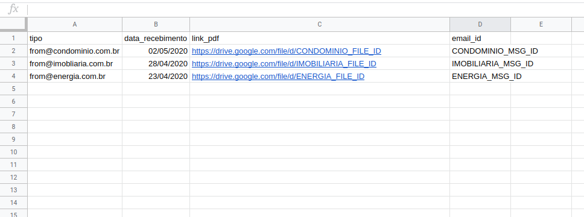

# My Home Expenses

Pacote de scripts para automatizar o preenchimento de uma planilha do Google Sheets com despesas da casa (aluguel, condomínio, etc).

O script integra as APIs do Gmail, Drive e Sheets para baixar os boletos de despesas recebidos mensalmente no e-mail, fazer o upload no Drive e adicionar o link do arquivo numa planilha do Sheets.

## Setup
- Python 3
- `pip install -r requirements.txt`
- Habilitar as APIs do Gmail, Drive e Sheets no Google APIs. Na página de [quickstart](https://developers.google.com/gmail/api/quickstart/python) contém as instruções para o Gmail, mas o processo é parecido para as demais.
- Salvar o arquivo de credenciais e salvar na raíz do diretório como _client_secret.json_
- Criar o arquivo _config.py_ a partir de _config_example.py_:
    - SPREADSHEET_ID: id da planilha do Sheets.
    - SHEET_NAME: nome da aba da planilha que armazenará os links para os arquivos.
    - FOLDER_ID: id da pasta do Drive onde os arquivos serão salvos.
    - EMAILS: lista com os endereços de email das empresas cujos anexos das mensagens enviadas por eles serão capturados.

## Utilização

Upload dos anexos do e-mail para o Drive:

``` python
python expenses_from_email.py
``` 

Upload de arquivo no armazenado localmente:

O parâmetro -e indica o tipo de despesa, -f indica o caminho para o arquivo do boleto.

```python
python expenses_from_file.py -e Claro -f /path-to-file.pdf
``` 

## Output
Após a execução dos scripts, a planilha é preenchida como mostra o exemplo abaixo. 
O script adiciona uma nova linha contendo quatro colunas: 
- Tipo da despesa (quando a fonte for um arquivo) ou o remetente (quando a fonte for a caixa de entrada do gmail)
- Data de recebimento.
- Link do Drive para o arquivo.
- Id da mensagem. Esta coluna serve para o script verificar se o anexo da mensagem já foi processado anteriormente. Nesse caso, o upload e escrita na planilha não é feito.



## TODOs
- Parser dos arquivos PDF para obter valor e data de vencimento

## Licença
[MIT](LICENSE)